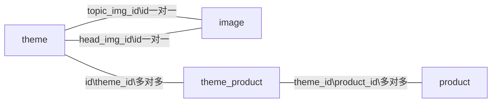
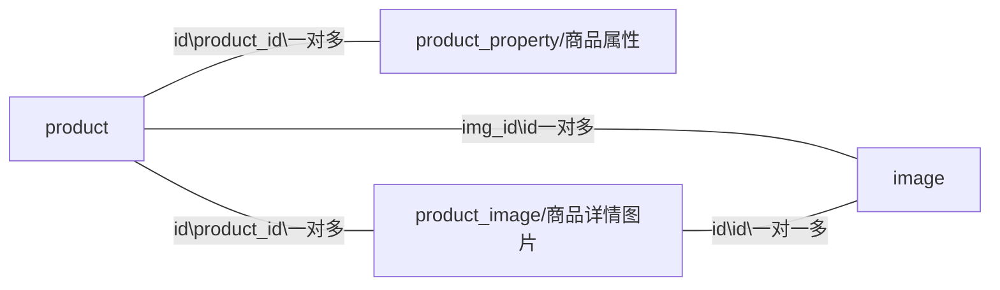
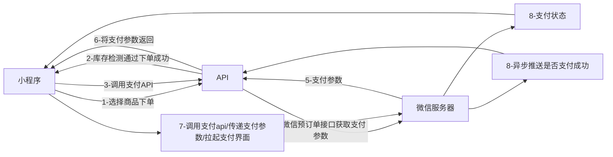

[TOC]
## url访问
PATH_INFO 混合模式 默认为混合模式

```
// 是否开启路由
'url_route_on'           => true,
```

`path_info`和路由混合使用（同一个方法开启路由后不能使用 path_info 模式）

强制使用路由模式

```
// 是否强制使用路由
'url_route_must'         => false,
```

1、PATH_INFO 模式的url路径

```
http://servaerName/index.php/module/controller/action/[param/value]
域名/入口文件/模块/控制器/方法/[参数名/参数值]
```

默认 url 不区分大小写

如果希望 URL访问严格区分大小写，可以在应用配置文件中设置：
```
// 关闭URL中控制器和操作名的自动转换
'url_convert' => false,
```

2、兼容模式 

```
http://servaerName/index.php?s=module/controller/action/[param/value]
```

3、缺点

    太长
    
    url路径暴露服务器结构文件
    
    不够灵活，不能很好支持url语义化 
## 命名空间更改

 config.php

```
// 应用命名空间
'app_namespace'          => 'app',
```

## No input file specified

使用TP框架做项目时，在启用REWRITE的伪静态功能的时候，首页可以访问，但是访问其它页面的时候，就提示：“No input file specified.”

原因:   在于使用的PHP5.6是fast_cgi模式，而在某些情况下，不能正确识别path_info所造成的错误

解决：在public 目录下 .htaccess 文件中进行修改即可（在 index.php后面加?）

```
RewriteRule ^(.*)$ index.php?/$1 [QSA,PT,L]
```

创建数据库

建立数据库，字符集 utf8mb4 ，排序规则 utf8mb4_general_ci

## 自定义控制器多级目录

在控制器下有分类时需要使用 `分类.控制器` 的方式在路由中设置路由地址
控制器文件夹下再分类时路由的使用

```php
rpute.php
//自动分别版本访问
Route::get('api/:version/banner/:id','api/:version.Banner/getbanner');
```

model 进行一般简单操作
service	进行复杂操作

## RESTFul API

基于rest的api设计理论，一般为json描述数据
基于资源变化，增删改查都只是对资源状态的改变
url 作为资源。

http动词(GET\POST\PUT)为资源的操作

    POST:创建
    GET:获取
    PUT:更新
    DELETE:删除

状态码:

    404 资源未找到(页面不存在)
    400 参数错误
    200 get获取资源成功
    201 post创建资源成功
    202 put更新成功(请求已发送但是服务器暂时没有处理)
    401 未授权
    403 被禁止
    500 服务器位置错误
统一描述错误：

错误码、错误信息、当前url

异常处理

    1、由于用户行为导致的异常，没有通过验证器、没有查询到结果
        不需要日志记录，需要向用户返回错误信息
    2、服务器自身异常；代码错误、调用第三方接口错误
        需要日志记录，不需要向用户返回错误信息
    设置全局异常处理
    重写框架自带异常类
    设置用户异常处理基类

## 数据库梳理

### 1、首页轮播图

banner banner_item 一对多

一个banner（对应不同banner位置）对应多个banner_item （每个位置对应的不同banner详情）

一个 banner_item 只能对应一个 banner

banner_item image 一对一

外键关联 banner_id、img_id


### 2、专题

theme 专题表

topic_img_id 首页专题图片

head_img_id 点击专题进入的头部图片

theme 专题、product 产品多对多


### 3、产品详情


## api版本自动识别切换

api多个版本时访问切换
在路由中将版本参数设为动态即可

```php
//动态api版本识别
Route::get('api/:apiversion/banner/:id','api/:apiversion.Banner/getbanner');
```

```
-api
 controller
 v1
   Banner.php
 v2
   Banner.php
```

访问

```php
http://tp/api/v1/banner/1
http://tp/api/v2/banner/1
```

model上层封装 service，将复杂业务放在 service 层中、将简单业务逻辑放在 model 层中

## sprintf(format,arg1,arg2,arg++)

把格式化的字符串写入变量中，把百分号（%）符号替换成一个作为参数进行传递的变量

*arg1*、*arg2*、*++* 参数将被插入到主字符串中的百分号（%）符号处。该函数是逐步执行的。在第一个 % 符号处，插入 *arg1*，在第二个 % 符号处，插入 *arg2*，依此类推

| 参数     | 描述                                                         |
| -------- | ------------------------------------------------------------ |
| *format* | 必需。<br />规定字符串以及如何格式化其中的变量。<br />可能的格式值：<br />%% - 返回一个百分号 <br />%%b - 二进制数%c - ASCII 值对应的字符<br />%d - 包含正负号的十进制数（负数、0、正数）<br />%o - 八进制数<br />%s - 字符串 |
| *arg1*   | 必需。规定插到 *format* 字符串中第一个 % 符号处的参数。      |
| *arg2*   | 可选。规定插到 *format* 字符串中第二个 % 符号处的参数。      |
| *arg++*  | 可选。规定插到 *format* 字符串中第三、四等 % 符号处的参数    |

```php
$number = 2;
$str = "Shanghai";
$txt = sprintf("There are %u million cars in %s.",$number,$str);
echo $txt;//There are 2 million cars in Shanghai
```

## curl

curl_init()	初始化

curl_setopt()	设置属性

curl_exec()	执行并获取结果

curl_close()	释放句柄

```php
function curl_get($url){
    $curl = curl_init();
    //需要获取的 URL 地址
    curl_setopt($curl, CURLOPT_URL, $url);
    //设置获取的信息以文件流的形式返回，而不是直接输出
    curl_setopt($curl, CURLOPT_RETURNTRANSFER, true);
    //允许 cURL 函数执行的最长秒数
    curl_setopt($curl, CURLOPT_TIMEOUT, 30);
    //在尝试连接时等待的秒数。设置为0，则无限等待
    curl_setopt($curl, CURLOPT_CONNECTTIMEOUT, 10);
    //FALSE 禁止 cURL 验证ssl证书
    curl_setopt($curl, CURLOPT_SSL_VERIFYPEER, false);
    //不检查服务器SSL证书中是否存在一个公用名
    curl_setopt($curl, CURLOPT_SSL_VERIFYHOST, false);
	//执行
    $output = curl_exec($curl);
    //获取一个cURL连接资源句柄的信息
    $info   = curl_getinfo($curl);
    //关闭释放句柄
    curl_close($curl);
	//检测 http状态码 是否已设置并且非 NULL且为200
    if (isset($info['http_code']) && 200 == $info['http_code']) {
        return $output;
    }else{
        return false;
    }
}

function curl_post($url, $data = [], $header = []){
    $curl = curl_init();
    curl_setopt($curl, CURLOPT_URL, $url);
    //TRUE 时会发送 POST 请求，类型为：application/x-www-form-urlencoded
    curl_setopt($curl, CURLOPT_POST, 1);
    if (!empty($header)) {
        //设置 HTTP 头字段的数组。格式:['Content-type: text/plain', 'Content-length: 100']
        curl_setopt($curl, CURLOPT_HTTPHEADER, $header);
    }
    //启用时会将头文件的信息作为数据流输出
    curl_setopt($curl, CURLOPT_HEADER, 0);
    curl_setopt($curl, CURLOPT_TIMEOUT, 30);
    curl_setopt($curl, CURLOPT_CONNECTTIMEOUT, 10);
    curl_setopt($curl, CURLOPT_RETURNTRANSFER, 1);
    //全部数据使用HTTP协议中的 "POST" 操作来发送
    curl_setopt($curl, CURLOPT_POSTFIELDS, $data);
    curl_setopt($curl, CURLOPT_SSL_VERIFYPEER, false);
    curl_setopt($curl, CURLOPT_SSL_VERIFYHOST, false);

    $output = curl_exec($curl);
    $info   = curl_getinfo($curl);
    curl_close($curl);

    if (isset($info['http_code']) && 200 == $info['http_code']) {
        return $output;
    }else{
        return false;
    }
}

//get、post
function httpcurl($url,$method,$data = [],$header = []){
    $curl = curl_init();
    curl_setopt($curl, CURLOPT_URL, $url);
    if($method=="POST"){
        curl_setopt($curl, CURLOPT_POST, 1);
        curl_setopt($curl,CURLOPT_POSTFIELDS,$data);
    }
    if (!empty($header)) {
        curl_setopt($curl, CURLOPT_HTTPHEADER, $header);
    }
    curl_setopt($curl, CURLOPT_HEADER, 0);
    curl_setopt($curl, CURLOPT_TIMEOUT, 30);
    curl_setopt($curl, CURLOPT_CONNECTTIMEOUT, 10);
    curl_setopt($curl, CURLOPT_RETURNTRANSFER, 1);
    curl_setopt($curl, CURLOPT_SSL_VERIFYPEER, false);
    curl_setopt($curl, CURLOPT_SSL_VERIFYHOST, false);

    $output = curl_exec($curl);
    $info   = curl_getinfo($curl);
    curl_close($curl);

    if (isset($info['http_code']) && 200 == $info['http_code']) {
        return $output;
    }else{
        return false;
    }
}
//调用
$data=['name'=>'admin','pwd'=>123]
httpcurl('http://ww.baidu.com',
         'POST',
         $data,
         ['Content-Type: application/json','Content-Length: ' . strlen($data)]
        )
```
## 权限控制
在访问与用户信息相关的接口是需要携带令牌进行访问且需要具备特定权限

利用前置操作对令牌验证、权限判断

前置操作需要该控制器继承基础Controller控制器类

## 订单-支付

用户选择商品，将选择的商品信息提交到订单api

接收到选择的商品信息**检查提交的商品的库存量**

1、有库存

&emsp;&emsp;1-1、将订单数据存入数据库，下单成功

&emsp;&emsp;1-2、**再次检测库存**，库存正常则调用微信支付

&emsp;&emsp;1-3、在调用微信支付至微信支付返回结果间**再次检测库存**

&emsp;&emsp;1-4、根据微信支付结果对库存量进行操作

&emsp;&emsp;1-5、成功：减少库存，

下单支付流程



2、无库存

### 创建订单

订单创建时需要将订单中涉及的商品谢谢、用户收获地址信息等可能变动的信息作为即时快照进行存储，

保证用户在后期查看历史订单时订单信息
订单中商品信息、地址信息等没有变化，

不会因为商家后台配置而改变历史订单信息

oredr -> product 多对多&emsp;拆分为两个一对多

    order_product->oredr | order_product->product

### 库存检测
### 微信支付
#### 支付成功回调处理库存、订单
## 历史订单
历史订单查询不能一次性把所有的查询出来

## 利用缓存性能优化
tp5 框架中模型类查询数据库每次都动态查询数据库数据表字段

将数据表、路由查询存为缓存，后续直接查询缓存


```
php think optimize:schema
php think optimize:route
```